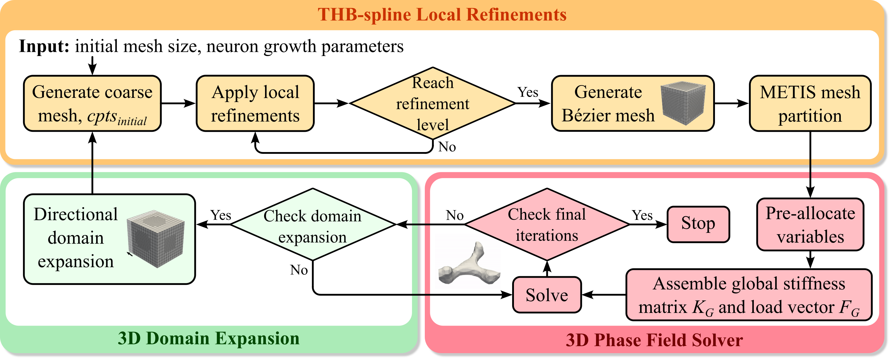
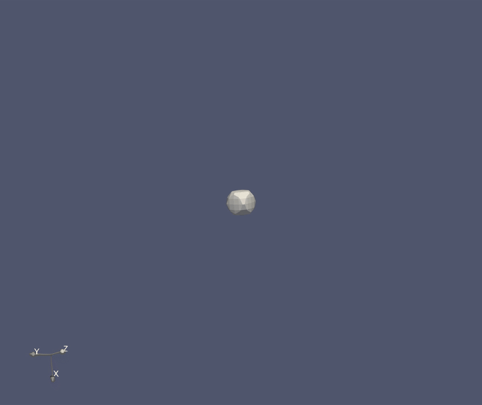
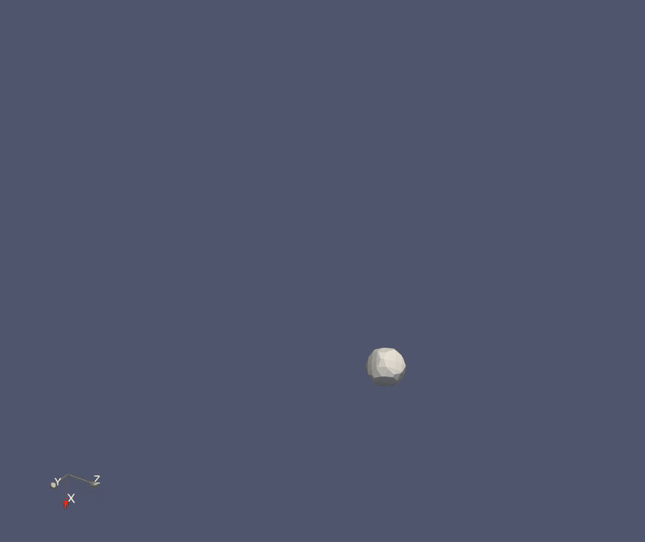
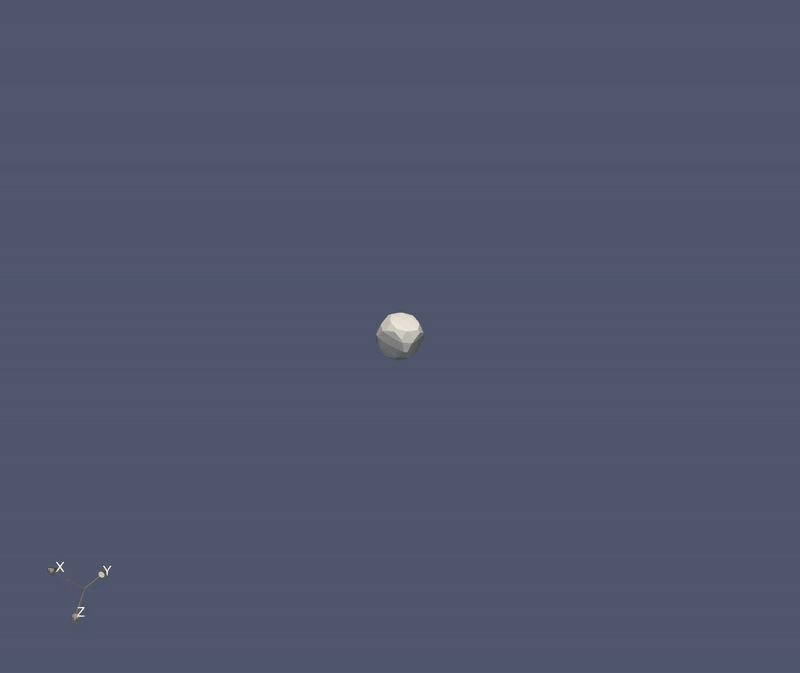
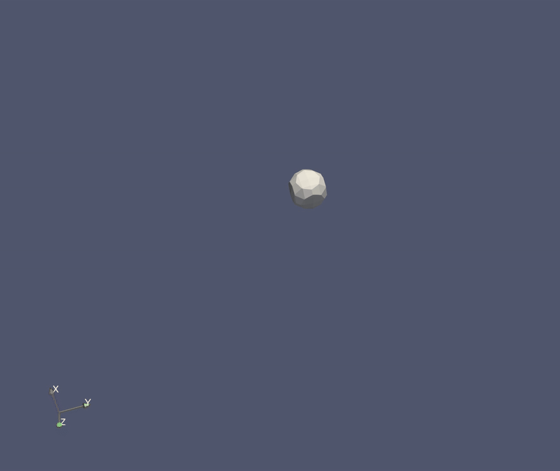
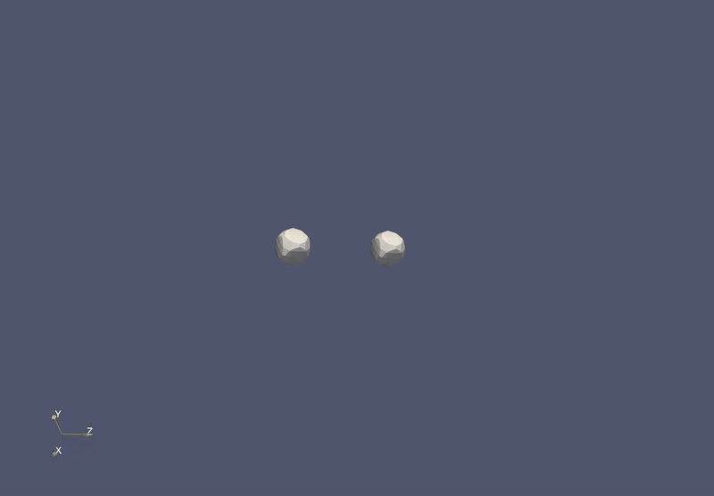
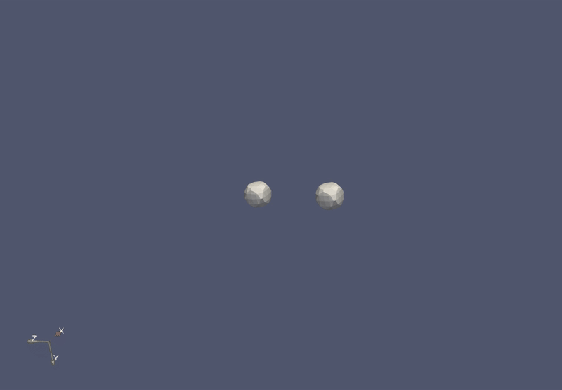
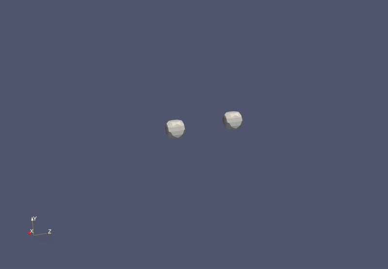
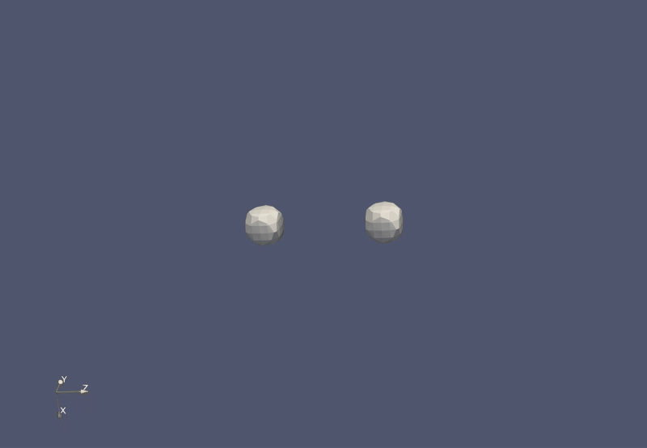

# 3D Phase Field Neuron Growth Simulation (IGA/THB-Splines)

## Overview

This C++ code simulates 3D neuron growth and neurodevelopmental disorder (NDD) deterioration using an Isogeometric Analysis (IGA) based phase field model. It employs Truncated Hierarchical B-splines (THB-splines) for adaptive local mesh refinement and couples phase field evolution with tubulin and neurotrophin dynamics. The framework supports modeling NDDs by adjusting simulation parameters.

## Key Features

* 3D Coupled Phase Field Model (Phase Field, Tubulin, Neurotrophin)
* Isogeometric Analysis (IGA) using THB-Splines
* Adaptive Multi-Level Local Refinement (Phase-field driven)
* Dynamic Domain Expansion during simulation
* 3D Neuron Identification and Tip Detection algorithms
* NDD Deterioration Modeling capability
* Parallel Execution using MPI and PETSc (SNES/KSP solvers)
* Checkpoint/Restart Functionality

## Simulation Workflow Overview

The simulation follows the general workflow depicted below:



*(Note: Store GIF and image files in a `media/` folder within the repository for these links to work).*

## Example Simulations

### Single Neuron Growth

Examples showcasing the growth and branching of a single neuron over time.

| Case 1                       | Case 2                       |
| :--------------------------: | :--------------------------: |
|  |  |
| **Case 3** | **Case 4** |
|  |  |

### Multi-Neuron Interaction

Examples showing the interaction and connection formation between two initially separate neurons.

| Case 1                       | Case 2                       |
| :--------------------------: | :--------------------------: |
|  |  |
| **Case 3** | **Case 4** |
|  |  |

*(Tip: Optimize your GIFs for size to ensure the README loads reasonably quickly).*

## Dependencies

* **C++ Compiler:** C++11 or later (GCC, Clang, Intel).
* **MPI:** MPI library (MPICH, OpenMPI).
* **PETSc:** Scientific computation library (\url{https://petsc.org/}), built with MPI support. Requires `PETSC_DIR` and `PETSC_ARCH` environment variables.
* **Nanoflann:** Header-only KD-tree library (included via relative path `../nanoflann/`). (\url{https://github.com/jlblancoc/nanoflann})
* **METIS (Recommended):** For graph partitioning (`mpmetis` command needed). (\url{http://glaros.dtc.umn.edu/gkhome/metis/metis/overview})
* **External Spline Tools (Required):** Pre-compiled executables needed in relative paths or system PATH:
    * `../spline3D_src/spline`: For Bezier extraction / spline processing.
    * `../THS3D/THS3D`: For THB-spline local refinement.
    *(Build these external tools separately).*

## Building the Code

*(Requires a PETSc-compatible build environment. Makefile not included).*

1.  Ensure all dependencies are installed and accessible.
2.  Set `PETSC_DIR` and `PETSC_ARCH` environment variables.
3.  Compile using `mpicxx` and link against PETSc libraries.

    **Example Makefile Snippet:**
    ```makefile
    include ${PETSC_DIR}/lib/petsc/conf/variables
    include ${PETSC_DIR}/lib/petsc/conf/rules

    TARGET = 3DNG
    SRCS = main.cpp NeuronGrowth.cpp utils.cpp BasicDataStructure.cpp
    OBJS = $(SRCS:.cpp=.o)
    INCLUDES = -I${PETSC_DIR}/${PETSC_ARCH}/include -I../nanoflann/1.5.5/include # Adjust Nanoflann path

    $(TARGET): $(OBJS)
        $(CXX) $(CFLAGS) -o $(TARGET) $(OBJS) ${PETSC_LIB}

    %.o: %.cpp
        $(CXX) $(CFLAGS) $(INCLUDES) -c $< -o $@

    clean:
        rm -f $(OBJS) $(TARGET)
    ```
    Run `make`.

## Input Files

Requires an input directory (`--path_in`) containing:

1.  **`simulation_parameters.txt`**: Key-value pairs defining model parameters (e.g., `dt`, `M_phi`). See example file.
2.  **Conditional Files:**
    * `phi.txt`: Needed if local refinement is active (specifies refinement flags).
    * `domain_size.txt`: Needed for restarting (contains grid dimensions/origin).
    * External tools might generate intermediate files here (`bzmeshinfo.txt`, `cmat.txt`, etc.).

## Running the Simulation

Execute via `mpirun`:

```bash
mpirun -np <N> ./3DNG \
       --numNeuron=<int> \
       --end_iter=<int> \
       --solver=<snes|ksp> \
       --path_in=<dir> \
       [--restart=<yes|no>]
```

* `<N>`: Number of MPI processes.
* `--numNeuron`: Number of initial neurons (1 or 2).
* `--end_iter`: Total simulation iterations.
* `--solver`: Nonlinear solver for phase field (`snes` recommended).
* `--path_in`: Path to input directory.
* `--restart`: Optional flag to continue from the last saved state (`yes` or `no`).

**Example:**

```bash
mpirun -np 64 ./3DNG --numNeuron=1 --end_iter=10000 --solver=snes --path_in=./inputs/case1/ --restart=no
```

## Simulation Parameters

Adjust simulation behavior by editing `simulation_parameters.txt` in the input directory. Key parameters include timestep (`dt`), mobility (`M_phi`), diffusion coefficients (`Dc`, `Diff`), and NDD control (`c_opti`).

## Output Files

Outputs are saved in an `outputs/` subdirectory inside the input path (`--path_in`).

* **`controlmesh_XXXXXX.vtk`**: Control mesh points and simulation variables ($\phi$, $c_{neur}$, etc.) at save intervals. Used for restarts.
* **`physics_allparticle_XXXXXX.vtk`**: Finer sampling of the physical domain with interpolated variables for visualization.
* **`domain_size.txt`**: (In `path_in`) Stores current domain size and origin, updated on expansion.

## Simulation Workflow Outline

*(The general workflow is visually represented in the "Simulation Workflow Overview" section above).*

1.  **Initialization:** Load parameters, set up initial mesh/state or load restart data.
2.  **Preprocessing:** Generate/read Bezier information, partition mesh (METIS).
3.  **Precomputation:** Calculate iteration-independent terms (basis functions, source terms).
4.  **Time Loop:**
    * Check for domain expansion and local refinement needs; trigger geometry updates and potential restart of `RunNG` if required.
    * Perform tip detection periodically.
    * Solve coupled PDEs for $\phi$, $c_{neur}$, $c_{tubu}$ using PETSc solvers.
    * Save output VTK files periodically.
5.  **Cleanup:** Release PETSc resources.

## Restart Capability

Use `--restart=yes`. The code finds the latest `controlmesh_*.vtk` in the output directory, reads `domain_size.txt` from the input directory, loads the state, and resumes from that iteration. Ensure `domain_size.txt` matches the latest VTK state.

## Code Structure

* `main.cpp`: Driver program, argument parsing, main simulation loop control.
* `NeuronGrowth.h`/`.cpp`: `NeuronGrowth` class, core physics, PETSc integration, algorithms.
* `utils.h`/`.cpp`: Helper functions (mesh I/O, MPI setup, external tool calls, KD-tree helpers, etc.).
* `BasicDataStructure.h`/`.cpp`: Basic geometry structs (`Vertex3D`, `Element3D`).

## Code Availability

The code is available at: \url{https://github.com/CMU-CBML/3D_THBNG}

## Contact

For questions, contact K.Q. (Kuanren Qian) or Y.J.Z. (Yongjie Jessica Zhang).
